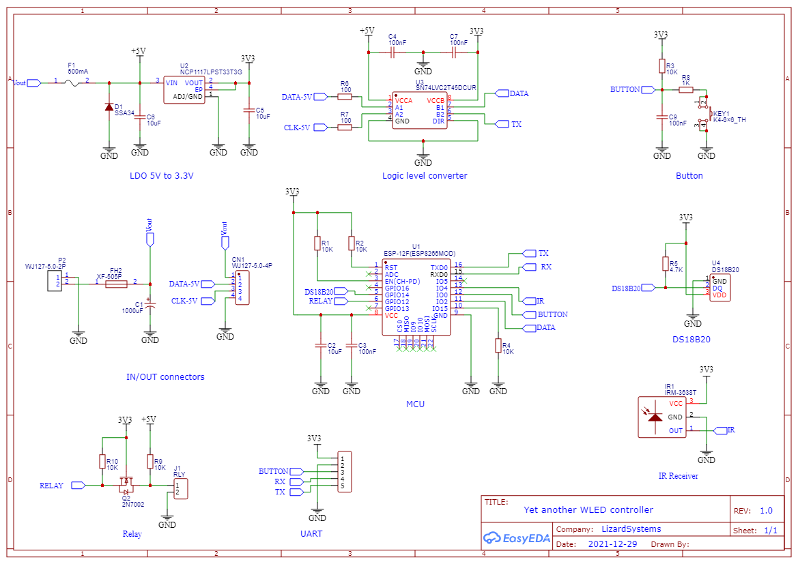
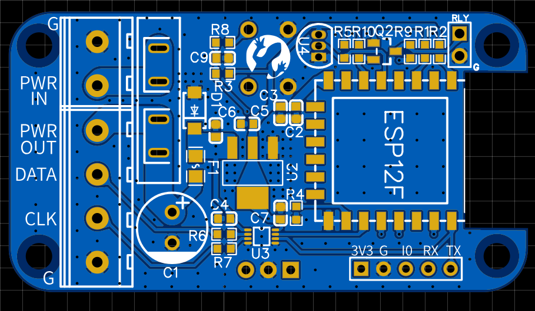
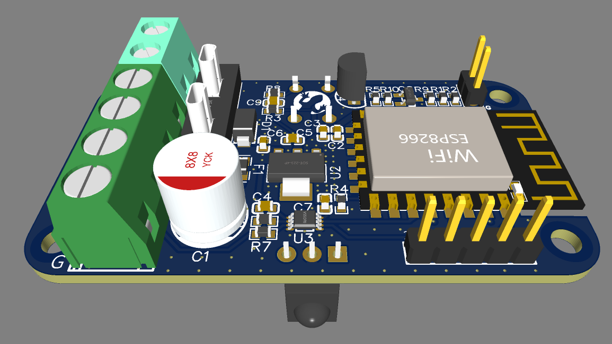

# Yet Another WLED Controller
This repository contains a schematic and PCB layout for a yet another WLED controller (yawl-controller).

This is the ESP8266 based wireless pixel controller to drive adressable LED stripes like Neopixel/SK6812/WS2801/etc using WLED.

## Features
 - Compact: 60x35x19mm with case, 59x32x12mm  without case.
 - Fuse for overcurrent protection.
 - Reverse polarity protection.
 - Modern [SN74LVC2T45](https://www.ti.com/product/SN74LVC2T45) bus transceiver with voltage translation. [Why?](level-shifter.md)
 - Capacitor 1000 µF at 6.3V, smooths the voltage and sudden changes in demand for current from the LEDs.
 - IR receiver (optional).
 - Button (optional).
 - Dallas temperature sensor for measuring ambient temperature inside of enclosure (optional).
 - Connection to relay for reducing power consumption when seemingly switched off (optional).

## Some credits

Thanks to [Christian Schwinne aka Aircoookie](https://github.com/Aircoookie) who created an excelent [WLED Project](https://github.com/Aircoookie/WLED) - a fast and feature-rich implementation of an ESP8266/ESP32 webserver to control NeoPixel (WS2812B, WS2811, SK6812) LEDs or also SPI based chipsets like the WS2801 and APA102.

Schematics are based on manufacturers datasheets but some component values come from [Adafruit Learning System](https://learn.adafruit.com/) so thanks to Adafruit for keeping their products open source.

## Idea

Small and simple device for 5V addressable LED strips with minimum components and fully assembled by PCB manufacturing service in standard case.

## Schematic

This is the schematic of YAWL controller

Download pdf file [Schematic_yet_another_wled_controller.pdf](Schematic_yet_another_wled_controller..pdf)

## PCB 
Dimensions: 
 - Width x Height: 59x32mm
 - Thickness: 1.6mm
 
### 2D View

### 3D View

### Case

PCB is designed for [AK-S-80](datasheets/AK-S-80.pdf) case

## Ordering and manufacturing

 - Gerber files: [Gerber_PCB_yet_another_wled_controller.zip](fabrication/Gerber_PCB_yet_another_wled_controller.zip)
 - BOM file: [BOM_PCB_yet_another_wled_controller.csv](fabrication/BOM_PCB_yet_another_wled_controller.csv)
 - BOM file (JLCPCB): [BOM_PCB_yet_another_wled_controller_(JLCPCB).xls](fabrication/BOM_PCB_yet_another_wled_controller_(JLCPCB).xls)
 - CPL file: [PickAndPlace_PCB_yet_another_wled_controller.csv](fabrication/PickAndPlace_PCB_yet_another_wled_controller.csv)

## Hardware

PCB manufactured by JLCPCB

SMT assembled PCB

Fully assembled device

In case 

## Firmware

### ESPHOME

## Compiling

## Flashing

## Installing

Installing relay https://kno.wled.ge/features/relay-control/

## Manual soldering and assembling

- Fuse holder [Micro](https://aliexpress.ru/item/4000541087990.html), Fuse 10A [Micro](https://aliexpress.ru/item/4000568246661.html) 
 - IR Receiver (optional) [TSOP38238](https://aliexpress.ru/item/32834341300.html)
 - Temperature sensor (optional) [DS18B20](https://aliexpress.ru/item/32523899337.html)
 - 3x Screw terminal 5mm (optional) [2P](https://aliexpress.ru/item/4000084631795.html)
 - Relay screw terminal 2.54mm (optional) [2P](https://aliexpress.ru/item/4000867583795.html)
 - Push button (optional) [6x6x9mm](https://aliexpress.ru/item/32912104842.html)
 - Case (optional) [80x38x22mm-Black](https://aliexpress.ru/item/1005002656761229.html) or [style 2](https://aliexpress.ru/item/1005001677364663.html)

## Resources
 - [WLED](https://github.com/Aircoookie/WLED) 
 - [ESPHOME](https://esphome.io/)
 
